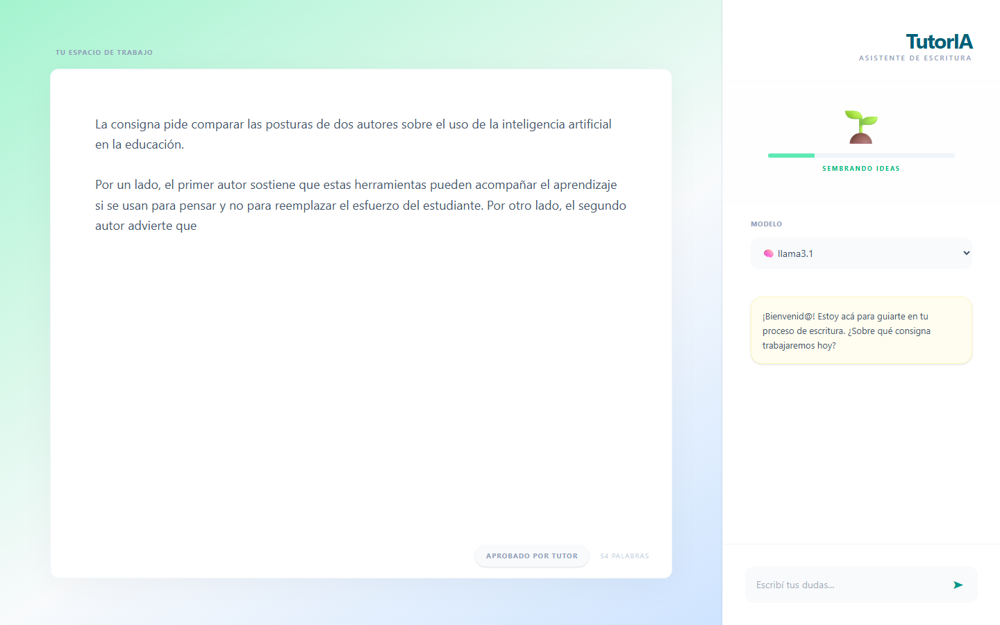

# TutorIA

**English** · [Español](README.es.md)

A Socratic writing tutor for academic assignments. Instead of writing the text for the student, TutorIA guides them through the writing process with one short question at a time.



> The interface is in Spanish (Rioplatense), which is the target audience of the project.

## How it works

The student writes in the editor on the left and talks to the tutor on the right. The tutor reads both the chat and the current draft, and guides the student through four stages:

| Stage | Goal |
|---|---|
| **A. Preparation** | Gather materials and decide how to study them |
| **B. First draft** | Understand the assignment, plan, and write a complete first version |
| **C. Revision** | Find and fix problems of clarity, structure and correctness, quoting the student's own text |
| **D. Closing** | Validate the final text and reflect on the writing process |

The model decides when the student is ready to move on: when a stage's goal is met, it appends a hidden `[AVANZAR]` tag to its reply, and the frontend advances the progress bar.

### Design decisions

- **Prompts live in YAML files, not in code.** `backend/prompts/base.yaml` defines the tutor's role, limits and tone; each stage has its own file. Pedagogy can be edited without touching Python.
- **The tutor never writes deliverable content.** It does not write assignments, does not invent citations, and asks one question per turn.
- **Runs locally with Ollama.** No API keys and no student text sent to third parties.

## Tech stack

- **Backend:** Python, FastAPI, LangChain, Ollama
- **Frontend:** React, Vite, Tailwind CSS
- **Models:** Llama 3.1 (default), Gemma and Qwen via Ollama — the list is set in `MODELOS_DISPONIBLES` in `main.py`

## Project structure

```
backend/
  main.py            API: prompt assembly, chat history, model selection
  prompts/
    base.yaml        Tutor role, limits and tone
    etapa_a.yaml     One file per stage (A–D)
    ...
frontend/
  src/App.jsx        Editor, chat and progress indicator
```

## Running locally

**Requirements:** Python 3.10+, Node.js 18+ and [Ollama](https://ollama.com).

1. Download a model:
   ```bash
   ollama pull llama3.1
   ```
2. Start the backend:
   ```bash
   cd backend
   python -m venv venv
   venv\Scripts\activate        # macOS/Linux: source venv/bin/activate
   pip install -r requirements.txt
   uvicorn main:app --reload
   ```
3. Start the frontend (in a second terminal):
   ```bash
   cd frontend
   cp .env.example .env
   npm install
   npm run dev
   ```
4. Open http://localhost:5173
